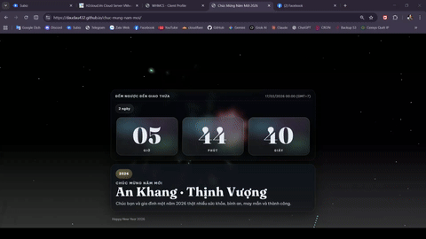

# Chúc-Mừng-Năm-Mới-2026

Một trang web chúc mừng năm mới 2026 với bầu trời pháo hoa (canvas) và lớp lời chúc tự hiện ngẫu nhiên. Thiết kế theo phong cách glass + giọt nước, chạy mượt trên desktop/mobile.

  
   
  <i>Click vào ảnh để xem video full (có âm thanh)</i>

## Highlight
- Pháo hoa tự động (có thể click/tap để bắn thêm).
- Lời chúc random hiện trên màn hình, tự fade out.
- Đồng hồ đếm ngược.

## Đếm Ngược Đến Giao Thừa 2026
Đồng hồ đang đếm ngược đến: **17/02/2026 00:00 (GMT+7)**.

## Cách Chạy
1. Mở `index.html` bằng trình duyệt.
2. Thử click/tap lên bầu trời để bắn pháo hoa.

## Deploy
Upload cả thư mục lên bất kỳ hosting tĩnh nào (GitHub Pages, VPS, shared hosting...).

## Tech
- HTML/CSS/JS
- Canvas 2D

---